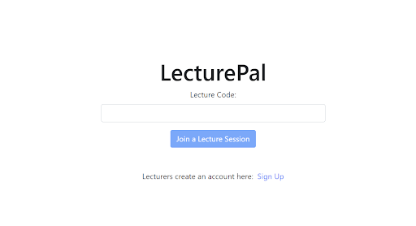

An web-based tool for investigating the feasibility of a web app enhancing lecture quality by fostering lecturer-student interaction without direct involvement in the lecture process.

# How to Use
- Go to https://synchronous-lecture-tool.firebaseapp.com/
- Signup for an account and create a Lecture
- Upload lecture slides (must be .pdf format), and share the join code with student users

# Developing
- setup a firebase project:
  - firestore
  - authentication (email / password)
- copy `.env.example` and add your firebase project config
- `npm start`

# Deploying
- deploy the firestore rules `firebase deploy --only firestore:rules --project <PROJECT ID>`
- `npm run deploy`
